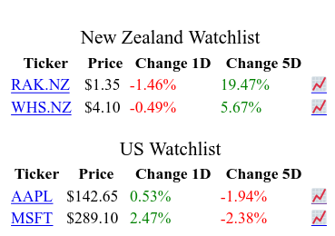

# watchlist addon

### Example


## Usage
1. install the addon
2. go to about:addons
3. select the addon and go to the preferences tab
4. insert a json object with the tickers in your watchlist

```{json}
{
    "Watchlist 1":[
        "ticker 1",
        "ticker 2",
        ...
    ],
    ...
}
```
5. press the save button